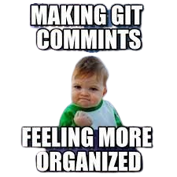
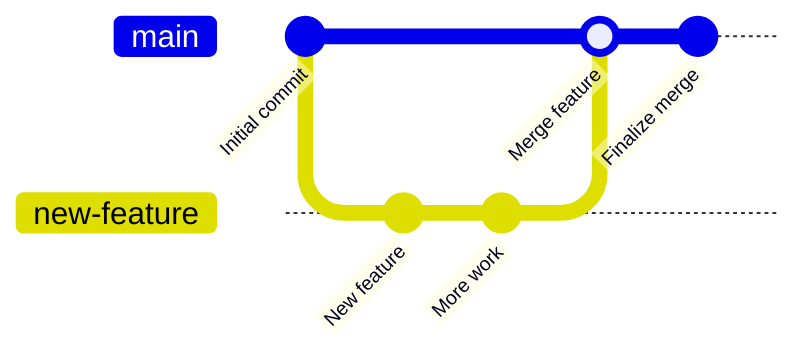
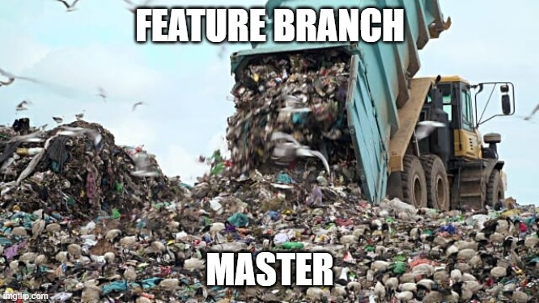

---
# You can also start simply with 'default'
theme: Dracula
# random image from a curated Unsplash collection by Anthony
# like them? see https://unsplash.com/collections/94734566/slidev
background: https://miro.medium.com/v2/resize:fit:828/format:webp/1*y7D5jICmjzvxZP6z-5EtDg.png
# some information about your slides (markdown enabled)
title: Welcome to Slidev
info: |
  ## Slidev Starter Template
  Presentation slides for developers.

  Learn more at [Sli.dev](https://sli.dev)
# apply unocss classes to the current slide
class: text-center
# https://sli.dev/custom/highlighters.html
highlighter: shiki
# https://sli.dev/guide/drawing
drawings:
  persist: true
# slide transition: https://sli.dev/guide/animations#slide-transitions
transition: fade
# enable MDC Syntax: https://sli.dev/guide/syntax#mdc-syntax
mdc: true
---

<!-- # title Project Management with Git -->

---

<v-clicks>
    <div>
      
      <p>Hello!! I am Rahul, and I build apps.</p>
    </div>
  <div style="position: relative; margin-left: 20px;">
  <p style="font-size: 32px; position: absolute; top: 50%; left: 320px; transform: translateY(-750%);">&#x2192;</p>
  </div>

</v-clicks>

---

# Initialize a Git Repository

<div
  v-motion
  :initial="{ x: 60 }"
  :enter="{ x: -50, y: 0 }"
  :click-1="{ x: 0, y: 60 }"
  :click-2="{ X:0,y: 50 }"
  :click-3="{ X:0,y: 40 }"
  :click-4="{ X:0,y: 30 }"
>

  <div v-click class="text-xl" style="margin-bottom: 50px;">
    Step 1: Navigate to your project director
  </div>
   <div  v-click class="text-xl" style="margin-bottom: 50px; background-color: #f5f5f5; padding: 10px 15px; border-radius: 5px; box-shadow: 0 4px 6px rgba(0, 0, 0, 0.1); font-family: 'Courier New', Courier, monospace; color: #333;">
    cd my-awesome-app
  </div >
    <div v-click class="text-xl" style="margin-bottom: 50px;">
    Step 2: Initialize a git repository
  </div>
  <div v-click class="text-xl" style="margin-bottom: 50px; background-color: #f5f5f5; padding: 10px 15px; border-radius: 5px; box-shadow: 0 4px 6px rgba(0, 0, 0, 0.1); font-family: 'Courier New', Courier, monospace; color: #333;">
    git init
  </div>
</div>
---

# Staging Changes in Git

<v-clicks>

  <div style="display: flex; justify-content: center; align-items: center; height: 60vh;">
    <div style="text-align: center;">
      
    </div>
  </div>
    <style>
    img:hover {
      transform: scale(1.1);
      box-shadow: 0 8px 16px black; 
    }
    subimg:hover{
      transform: scale(1.1);
      box-shadow: 0 8px 16px black; 
    }
  </style>
</v-clicks>

---

# Committing Changes in Git

<div
  v-motion
  :initial="{ x: 60 }"
  :enter="{ x: 0, y: 0 }"
  :click-1="{ x: 0, y: 60 }"
  :click-2="{ X:0,y: 50 }"
  :click-3="{ X:0,y: 40 }"
  :click-4="{ X:0,y: 30 }"
>

  <div v-click class="text-xl" style="margin-bottom: 50px;">
    Step 1: Navigate to your project director
  </div>
   <div  v-click class="text-xl" style="margin-bottom: 50px; background-color: #f5f5f5; padding: 10px 15px; border-radius: 5px; box-shadow: 0 4px 6px rgba(0, 0, 0, 0.1); font-family: 'Courier New', Courier, monospace; color: #333;">
    cd my-awesome-app
  </div >
    <div v-click class="text-xl" style="margin-bottom: 50px;">
    Step 2: In terminal
  </div>
  <div v-click class="text-xl" style="margin-bottom: 50px; background-color: #f5f5f5; padding: 10px 15px; border-radius: 5px; box-shadow: 0 4px 6px rgba(0, 0, 0, 0.1); font-family: 'Courier New', Courier, monospace; color: #333;">
     git add .
  </div>
</div>

---

# Commit Message Rule

<!-- <div v-click="3"> visible after 3 clicks </div>
<v-click at="2"><div> visible after 2 clicks </div></v-click> -->
<!-- <div v-click.hide="1"> hidden after 1 click </div> -->

```js {none|1|2}{at:2}
1  Be Descriptive and Concise.
2  Example: `Fix bug in user login authentication`
```

<v-clicks >
  <div style="display: flex; justify-content: center; align-items: center; height: 60vh;">
    <div style="text-align: center;">
      
    </div>
  </div>
</v-clicks>

---

# Comminting the changes

```mermaid
gitGraph
  commit id: "Commit 1"
  commit id: "Commit 2"
  commit id: "commit 3"
````
</v-clicks>

<div
  v-motion
  :initial="{ x: 60 }"
  :enter="{ x: 50, y: 0 }"
  :click-1="{ x: 0, y: 60 }"
  :click-2="{ X:0,y: 50 }"
  :click-3="{ X:0,y: 40 }"
>

  <div v-click class="text-xl" style="margin-bottom: 50px;">
    Step 1: commiting the commits
  </div>
   <div v-click class="text-xl" style="margin-bottom: 50px; background-color: #f5f5f5; padding: 10px 15px; border-radius: 5px; box-shadow: 0 4px 6px rgba(0, 0, 0, 0.1); font-family: 'Courier New', Courier, monospace; color: #333;">
     git commit -m "Your Message"
  </div>
   <div v-click class="text-xl" style="margin-bottom: 50px;">
    Note : Keep commit messages short and clear for easy understanding and tracking.
  </div>
</div>

---

# Branch Naming

<v-clicks>
  <div style="display: flex; justify-content: center; align-items: center; height: 60vh;">
    <div style="text-align: center;">
      <img src="assets/images/git branching.jpg" alt="Boy Planning" height="200" width="350" style="margin-right: 20px;">
    </div>
  </div>
</v-clicks>
---

# Branching in git

<v-clicks>

<div style="display: flex; justify-content: center; align-items: center; height: 60vh">
```mermaid
graph TD;
    A[Start on master branch] --> B[Check current branch with 'git branch'];
    B --> C[Create a new branch with 'git branch <new-branch-name>'];
    C --> D[Switch to the new branch with 'git checkout <new-branch-name>'];
    D --> E[Start working on the new branch];
````

</div>
</v-clicks>
---

# Creating branch in Git

<div
  v-motion
  :initial="{ x: 60 }"
  :enter="{ x: -50, y: 0 }"
  :click-1="{ x: 0, y: 60 }"
  :click-2="{ X:0,y: 50 }"
  :click-3="{ X:0,y: 40 }"
>

  <div v-click class="text-xl" style="margin-bottom: 50px;">
    Step 1: create and checkout to the branch
  </div>
   <div v-click class="text-xl" style="margin-bottom: 50px; background-color: #f5f5f5; padding: 10px 15px; border-radius: 5px; box-shadow: 0 4px 6px rgba(0, 0, 0, 0.1); font-family: 'Courier New', Courier, monospace; color: #333;">
     git checkout -b feature/navigationBar
  </div>
  <div v-click class="text-xl" style="margin-bottom: 50px;">
    Note : Keep the branch names as per the naming convention
  </div>
</div>

---

# New Branch

<div style="display: flex; justify-content: center; align-items: center; height: 50vh; margin: 0;">
```mermaid
    gitGraph
        commit
        commit
        branch develop
        commit
        commit
        commit
```

<v-clicks>

</div>

---

# Raising a PR (Pull Request)

<div
  v-motion
  :initial="{ x: 60 }"
  :enter="{ x: 0, y: 0 }"
  :click-1="{ x: 0, y: 60 }"
  :click-3="{ X:0,y: 40 }"
  :click-4="{ X:0,y: 30 }"
  :click-5="{ X:0,y: 20 }"
  :click-6="{ X:0,y: 10 }"
>

  <div v-click class="text-xl" style="margin-bottom: 50px;">
    Step 1: create and checkout to the branch
  </div>
  <div v-click class="text-xl" style="margin-bottom: 50px; background-color: #f5f5f5; padding: 10px 15px; border-radius: 5px; box-shadow: 0 4px 6px rgba(0, 0, 0, 0.1); font-family: 'Courier New', Courier, monospace; color: #333;">
     <span v-mark.underline.red> git push origin [branchName]</span>
  </div>
    <div v-click class="text-xl" style="margin-bottom: 50px;">
    Step 2: Create a new  pull Request
  </div>
    <div v-click class="text-xl" style="margin-bottom: 50px;">
    Step 3: enter the context for the issue.
  </div>
  <div v-click class="text-xl" style="margin-bottom: 50px;">
    Step 4: Tag reviewers
  </div>
</div>

---

# Rasing PR in github

<v-clicks>
  <div style="display: flex; justify-content: center; align-items: center; height: 60vh;">
    <div style="text-align: center;">
      
    </div>
  </div>
</v-clicks>

---

# Mergining in Git

<v-clicks>

</v-clicks>

<div
  v-motion
  :initial="{ x: 60 }"
  :enter="{ x: 50, y: 0 }"
  :click-1="{ x: 0, y: 60 }"
  :click-2="{ X:0,y: 50 }"
  :click-3="{ X:0,y: 40 }"
>

  <div v-click class="text-xl" style="margin-bottom: 50px;">
    Step 1: Your reveiwers will check the code quality and
  </div>
  <div v-click class="text-xl" style="margin-bottom: 50px;">
    Step 2: If everything is ok , thwy will merge the code
  </div>
    <div v-click class="text-xl" style="margin-bottom: 50px; background-color: #f5f5f5; padding: 10px 15px; border-radius: 5px; box-shadow: 0 4px 6px rgba(0, 0, 0, 0.1); font-family: 'Courier New', Courier, monospace; color: #333;">
     git merge [branchName]
  </div>
</div>

---

# After Merge

<v-clicks>
  <div style="display: flex; justify-content: center; align-items: center; height: 60vh;">
    
  </div>
</v-clicks>

---

# Pull Code to Master

<div
  v-motion
  :initial="{ x: 60 }"
  :enter="{ x: 0, y: 0 }"
  :click-1="{ x: 0, y: 60 }"
  :click-2="{ X:0,y: 50 }"
>

  <div v-click class="text-xl" style="margin-bottom: 50px;">
    Step 1 : To pull the code to master branch after merge
  </div>
  <div v-click class="text-xl" style="margin-bottom: 50px; background-color: #f5f5f5; padding: 10px 15px; border-radius: 5px; box-shadow: 0 4px 6px rgba(0, 0, 0, 0.1); font-family: 'Courier New', Courier, monospace; color: #333;">
     git pull
  </div>
</div>

---

# Pull on Master

<v-clicks>
  <div style="display: flex; justify-content: center; align-items: center; height: 60vh;">
    
  </div>
</v-clicks>

---

<v-clicks>
  <div style="display: flex; justify-content: center; align-items: center; height: 60vh;">
    
  </div>
</v-clicks>
